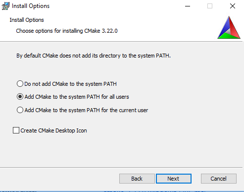
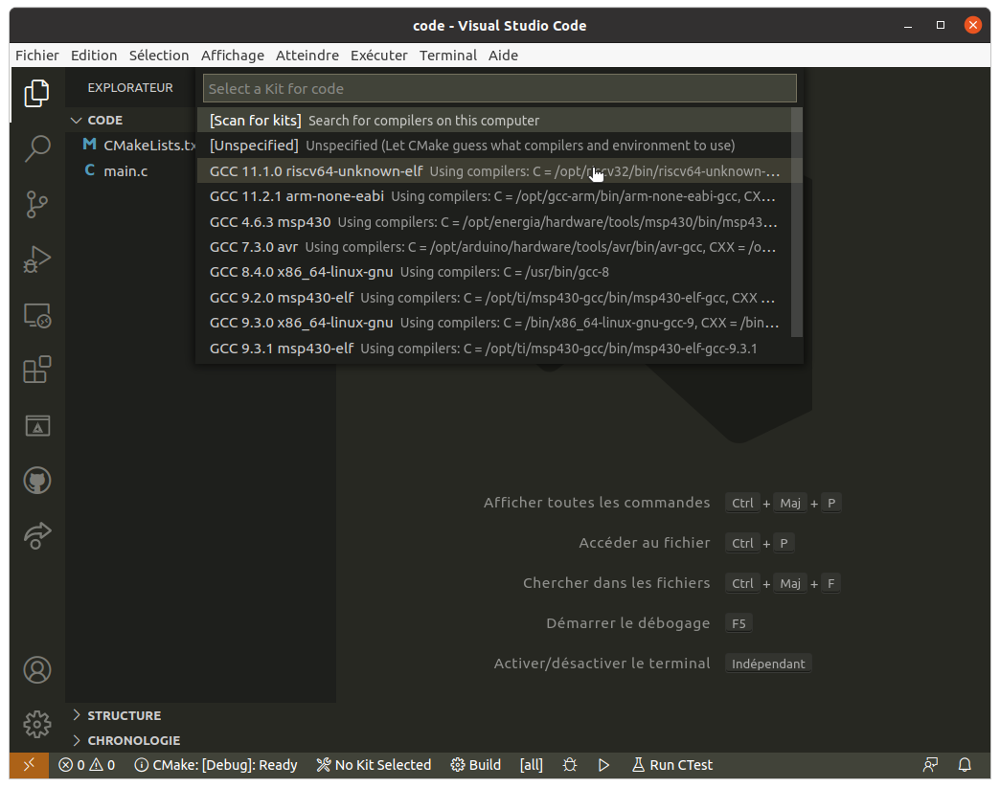
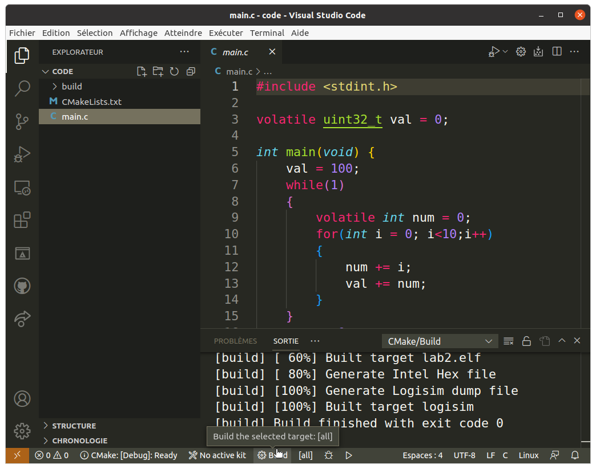
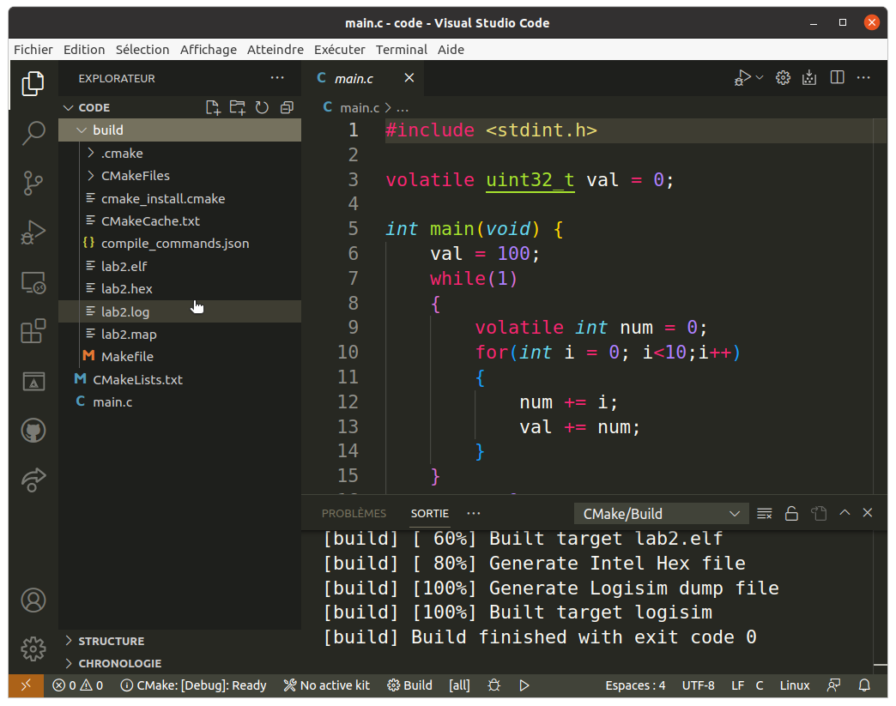

# RISC-V toolchain and VSCode integration

This *Howto* gives some hints about installing a cross-compiler for RISC-V, as well as configuring Microsoft VSCode. We use CMake to build baremetal application.

## Prerequisites

Here, we use:
 * a cross-compiler for the RISC-V baremetal (`riscv64-unknown-elf-gcc`…).
 * a tool to handle the project (compilation/flash recipes): `cmake`, with help of `Makefile` on Linux/Max and `ninja` on Windows
 * python: to convert binary file to the logisim format

## Compiler
The compiler suite is `riscv64-unknown-elf-gcc`. The name stands for:
 * `riscv64`: the processor target (can compile for both 32 and 64-bits targets)
 * `unknown`: the operating system. Here `unknown` means that there is no operating system (baremetal). It should not be `linux` here!
 * `elf` is the Application Binary Interface and defines the rules to interact with other binaries (how to give the function arguments in the asm for instance)
 * `gcc` is the name for the `GNU Compiler collection`, a widely uses compiler.

Installation:

 * from [sources on GitHub](https://github.com/riscv-collab/riscv-gnu-toolchain). Compilation is easy on Linux, explanations in the README.
 * pre-built versions [for Windows/Linux/Mac](https://www.embecosm.com/resources/tool-chain-downloads/).
 * pre-built version for [Windows](https://gnutoolchains.com/risc-v/). (not tested)
 * on Mac you may use [homebrew](https://github.com/riscv-software-src/homebrew-riscv).

## CMake
The CMake build process software [can be downloaded here](https://cmake.org/download/). You should choose the `.msi` file (windows installer).

During installation, please check the `add CMake to the system PATH`. In the other case, you will have to do it manually.

CMake will need a generator, as explained in [this page](https://cmake.org/cmake/help/latest/manual/cmake-generators.7.html). On Unix (Linux/Mac), the generator `GNU Make` as already available. On Windows, this generator is not so easy to install. We will use `ninja`.

`Ninja` can be found [here](https://github.com/ninja-build/ninja/releases):
 * download the binary `ninja-win.zip`
 * unzip the zip file
 * move the binary file to a location in the windows path. An easy way is to mode the binary to the `CMake/bin` folder (`C:\Program Files\CMake\bin`). It will work directly.

## VSCode IDE

With VSCode, open the folder with the code `lab2/code`. VScode will ask for the toolchain (even if it is hardcoded in the cmake rules…)

Then, you need to compile the application with the `build` button in the status bar:

.

If there are some problems, you can have a look at `sys/cmake` directory, where the `cmake` rules are defined.

The generated files are in the `build` directory:
 * `lab2.elf`: generated binary file (with debug symbols)
 * `lab2.hex`: file in Intel format. ascii file
 * `lab2.map`: memory mapping
 * `lab2.log`: file for logisim

